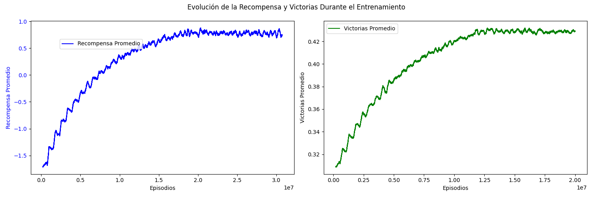
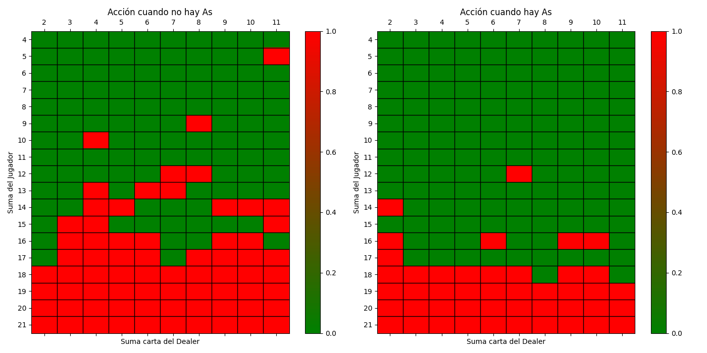

# Agente Inteligente de Blackjack con Q-Learning

## Descripción del Proyecto

Este proyecto consiste en un agente inteligente que ha aprendido a jugar al Blackjack utilizando aprendizaje por refuerzo y el algoritmo Q-Learning. El agente desarrolla una política de decisión basada en la suma de las cartas del jugador y la primera carta visible del dealer.

## Funcionamiento

El agente toma decisiones en función de dos políticas distintas:

- **Manos duras:** Cuando el jugador no tiene un As usable.

- **Manos blandas:** Cuando el jugador tiene al menos un As usable.

Cada política se representa en forma de tablas de doble entrada, donde:

- Las filas indican los valores posibles de la suma del jugador (de 4 a 21).

- Las columnas representan las cartas que el dealer puede mostrar (de 2 a 11).

- Los casilleros verdes indican pedir carta, y los rojos quedarse.

El entrenamiento del agente se llevó a cabo en 20 millones de partidas, utilizando una función de recompensa que:

- Otorga puntos por ganar y por no pasarse de 21 (más cerca de 21, mayor la recompensa).

- Penaliza por perder y por pasarse de 21 (cuanto más se pasa, mayor la penalización).

## Evaluación del Aprendizaje

Para verificar que el agente ha aprendido correctamente, se generaron las siguientes visualizaciones:

- **Gráfica de convergencia de la recompensa:** Muestra cómo el agente mejora sus decisiones con el tiempo.

- **Gráfica de convergencia de la cantidad de victorias:** Indica el progreso del agente en términos de partidas ganadas.

A continuación, se incluyen las imágenes de convergencia y las tablas que representan las políticas:





## Resultados

Tras completar el entrenamiento, se realizaron 100,000 partidas con explotación pura, obteniendo un porcentaje de victorias del 44%.

Es importante notar que la política de decisión aprendida por el agente no es la óptima, aunque sí es muy buena. Esto puede deberse a varios factores, como:

- **Diseño de la función de recompensa:** La recompensa no solo premia ganar, sino también estar cerca de 21. Esto puede haber llevado al agente a priorizar estrategias demasiado conservadoras.

- **Número finito de partidas:** Aunque 20 millones de partidas es una cantidad grande, el espacio de estados y acciones en Blackjack sigue siendo extenso, lo que puede hacer que algunas situaciones no se hayan explorado lo suficiente.

## Instalación y Uso

Clona el repositorio:
```
git clone https://github.com/tobiasgrandi/Agente_BlackJack
cd Agente_BlackJack
```
Ejecuta el script de entrenamiento del agente:

```
python main.py
```
